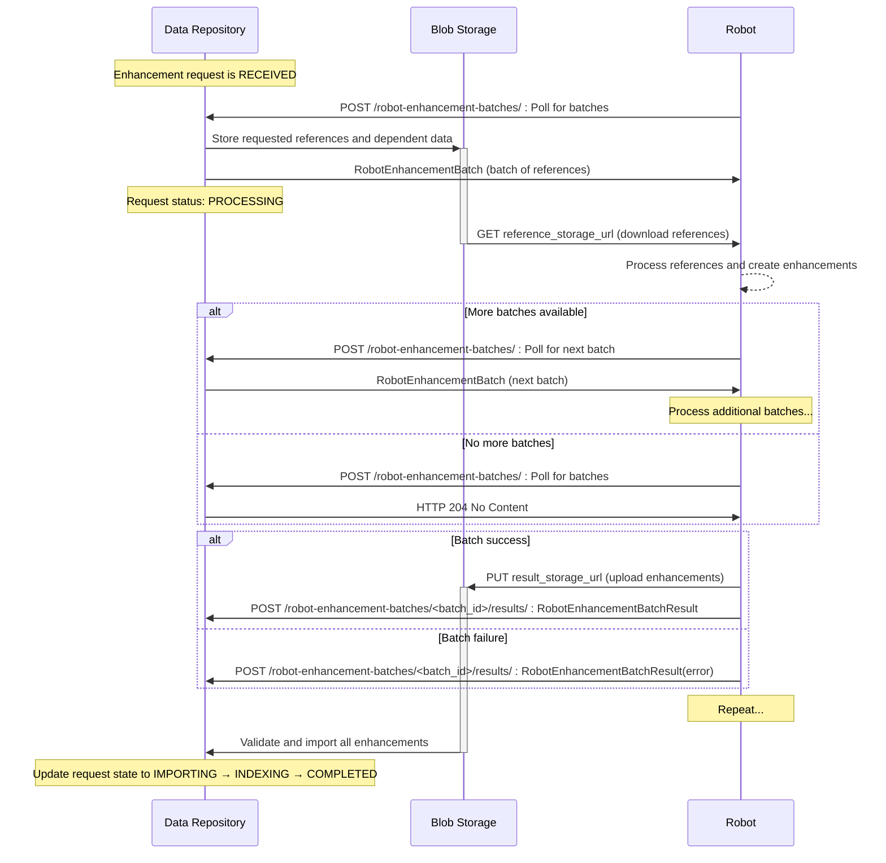

# Fetch Everything Robot

A _DESTINY_ robot for retrieving full texts from various third-party APIs, and adding them to `Reference`s as an `Enhancement`.

This derived from the example robot producing toy enhancements against the destiny repository available at [destiny-evidence/toy-robot](https://github.com/destiny-evidence/toy-robot).

## tl, dr

A **robot** is an extension/plugin to the _DESTINY_ repository, which, using _DESTINY_'s API (specifically POST) endpoints to create `Enhancement`s on the core unit of analysis, `Record`s (the bespoke data model for scientific publications, reports, papers, etc. which are stored in _DESTINY_-repository).

The **Fetch Everything Robot (FER)** contains functionality for retrieving full texts (and more!) for target works by [_DOI_](https://en.wikipedia.org/wiki/Digital_object_identifier). Everything are retrieved from third-party APIs and transformed into generic enhancements to a target work. Third-party APIs are configured via an `APIConfig` class, with functionality for handling authentication, parsing and string cleaning. The hierarchy of which API to hit first is then declared in an `ExternalAPIPriority` class.

If further third-party APIs are to be added, simply instantiate such an `APIConfig`, and import and add it to `available_api_configs` in `main.py`.

## Setup

### Requirements

[uv](https://astral.sh/uv/) is used for dependency management and managing virtual environments. You can install uv either using `pipx install uv` or the uv installer script:

```sh
curl -LsSf https://astral.sh/uv/install.sh | sh
```

### Installing Dependencies

Once uv is installed, set up a virtual environment:

```sh
uv venv
source .venv/bin/activate
```

Then install the dependencies with the uv-managed `pip`:

```sh
uv sync
```

To install additional development and test dependencies, run:

```sh
uv sync --all-extras
```

## Development

Before commiting any changes, please run the pre-commit hooks. This will ensure that the code is formatted correctly and minimise diffs to code changes when submitting a pull request.

After installing dependencies as shown above, install the pre-commit hooks:

```sh
pre-commit install
```

pre-commit hooks will run automatically when you commit changes. To run them manually, use:

```sh
pre-commit run --all-files
```

See `.pre-commit-config.yaml` for the list of pre-commit hooks and their configuration.

Import modules from the `fer` package. For example:

```python
from fer.fetching.crossref import CrossrefFetcher
```

## Application

Run the application locally with:

```sh
uv run run_robot.py
```

## Implemented request flow

### Batch Enhancement Request Flow



## Authentication Against Destiny Repository

Authentication between the Fetch Everything Robot and Destiny Repository uses HMAC authentication, where a request signature is encrypted with the robot's secret key and set as a header. To simplify this process, the destiny_sdk provides a client for communicating with destiny repository that handles adding signatures. In Fetch Everything Robot the client is inititalised in app/main.py and used for sending requests.

### Configuring Authentication

- If you are running the robot with a local instance of destiny repository that is not enforcing authentication, add `ENV=local` to your `.env` file. This will cause the robot to bypass authentication. This is to allow easy development only and the robot should not be deployed with `env=local`.
  - In this case you will need to set dummy values for the `ROBOT_ID` and the `ROBOT_SECRET`. For example `ROBOT_ID="9fa8b9bd-12b1-4450-affb-712face23390"` and `ROBOT_SECRET="dummy_secret"`
- If you want to deploy the Robot and use it with destiny repository, the robot will need to be registered with that deployment of destiny repository. The registration process will provide the robot_id and client_secret needed to configure authentication. You can check out the proceedure for registering a robot [in the DESTinY documentation](https://destiny-evidence.github.io/destiny-repository/procedures/robot-registration.html).

## Container Image

When building the docker image

```sh
docker buildx build --tag fetch-everything-robot .
```

### Manual push

If you want to deploy the robot into Azure using the provided terraform infrastructure, you'll need to manually push the docker image to a container registry. We're using destiny-shared-infra for this.

```sh
az login
docker buildx build --no-cache --platform linux/amd64 --tag destinyevidenceregistry.azurecr.io/fetch-everything-robot .
az acr login --name destinyevidenceregistry
docker push destinyevidenceregistry.azurecr.io/fetch-everything-robot:YOUR_TAG
```

Then you can deploy your image to the container app

```sh
az containerapp update az containerapp update -n fetch-everything-robot-stag-app -g rg-fetch-everything-robot-staging --image estinyevidenceregistry.azurecr.io/fetch-everything-robot:YOUR_TAG
```

Then you can restart the revision with the following command

```sh
az containerapp revision restart --name fetch-everything-robot-stag-app --resource-group rg-fetch-everything-robot-staging --revision [REVISION_NAME]
```
